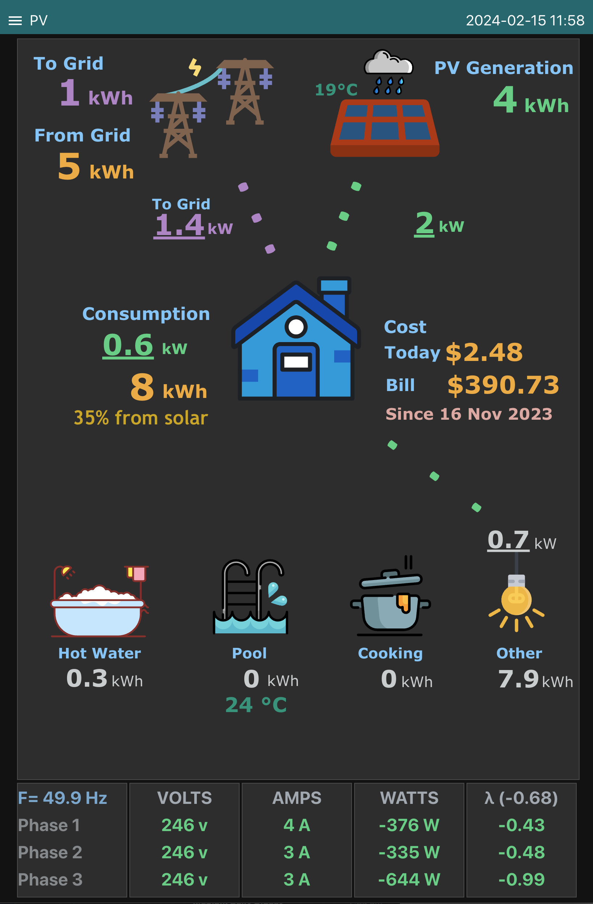

# Node-Red dashboard using SVG for power monitoring

## About

This project is dedicated to creating a visually appealing dashboard for monitoring electricity usage and generation. The goal is to provide an intuitive interface that effectively communicates power-related data.

## Pre-requisites

Before getting started, ensure the following prerequisites are met:

1. Node-Red: Install Node-Red on your system.
2. node-red-dashboard: Install the Node-Red Dashboard plugin.
3. node-red-contrib-ui-svg: Install the Node-Red SVG plugin.

## Method

Follow these steps to set up the project:

1. Import JSON File:

Import the provided JSON file content into a new flow in Node-Red. This serves as the foundation for your power monitoring dashboard.

2. Edit SVG and Nodes:

Customize the SVG and other nodes to align with the available data and your specific monitoring needs. This includes adjusting visual elements, layouts, and any other aspects of the dashboard.

3. Send Energy Data to MQTT Topics:

Ensure that energy data is sourced and sent to MQTT topics. This step is crucial for populating the dashboard with real-time data.

## Screenshots

### Weather widgets added
It shows Clear Sky (Sun or Moon depending on the time), Clouds (with sun or moon), Clouds only and Rain widgets based on the data recived from openweathermap.
It also shows the temperature.

PLEASE NOTE: At the moment, this project serves as a comprehensive guide on integrating SVG into the Node-Red dashboard. Keep in mind that energy data must be sourced and sent via MQTT to fully utilize the capabilities of this project. Use this guide as a starting point for creating a powerful and visually engaging power monitoring solution tailored to your specific requirements.
